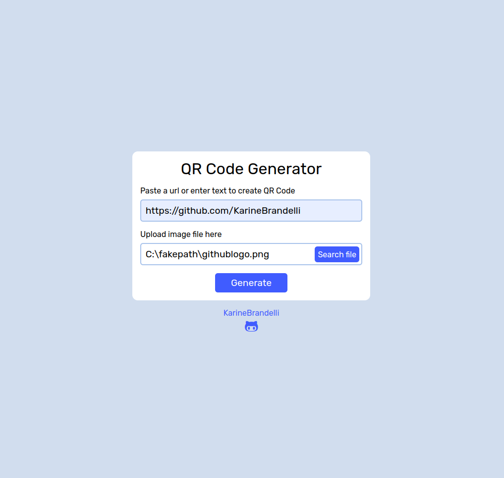

<h1 align="center"> Gerador de QR Code estilizado ✨ </h1>

## Descrição ✏️

  O projeto consiste em um gerador de QR Code, onde o usuário insere a url ou texto a ser convertido e também pode optar em inserir uma imagem personalizada.

## Preview 🔎

  
  

## Tecnologias ⚒️

O projeto foi desenvolvido com as seguintes tecnologias:

- HTML
- CSS
- JavaScript
- DOM
- Git e GitHub

## Recursos adicionais 💡

  A fim de incrementar o projeto, foi utilizado uma biblioteca chamada QR Code Styling, que permite gerar um QR Code com cores diferentes, bordas arredondadas e também com uma imagem no centro escolhida pelo usuário.

